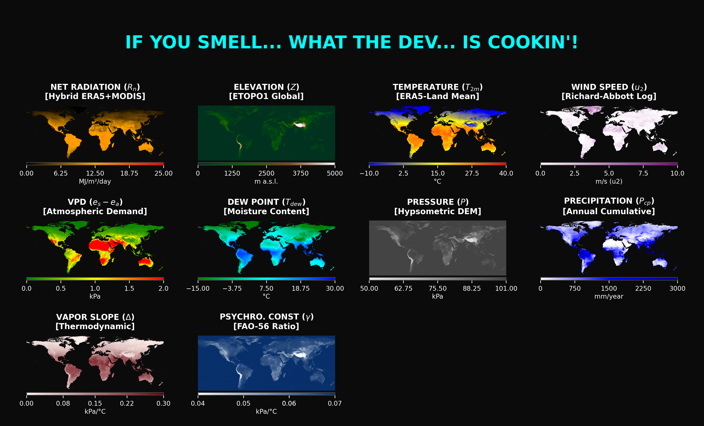
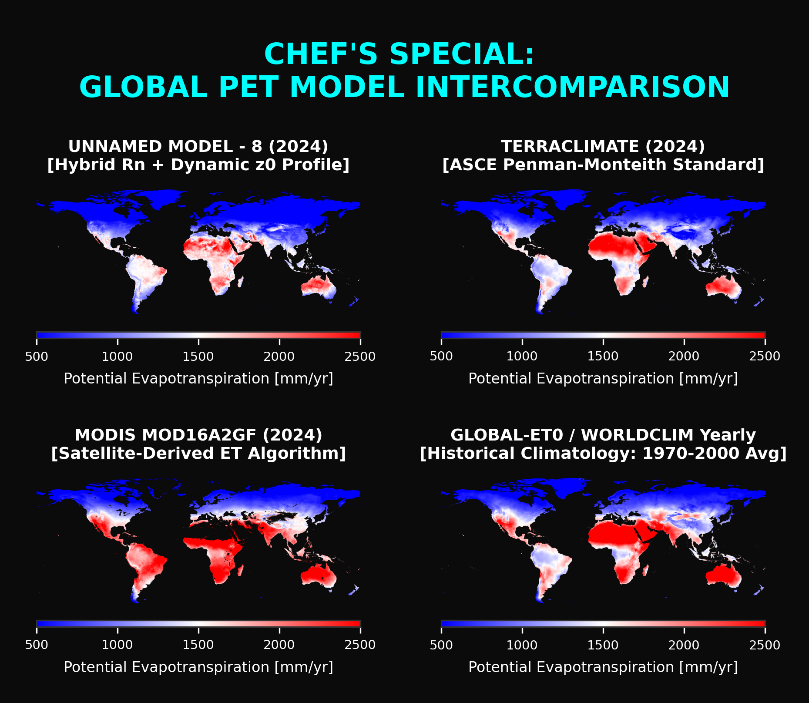
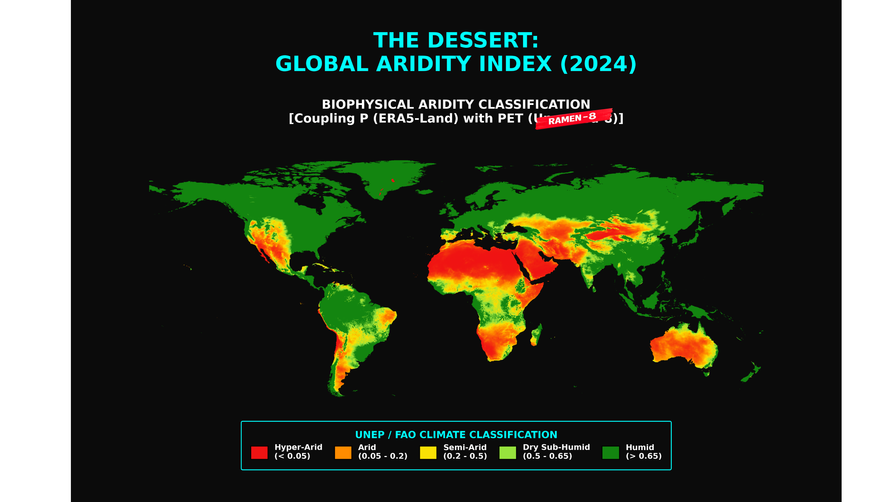

#

  

***

# **Get your chef’s coat on: it's time to cook up something interesting!**

I want you to join me on this day of reflection. I’d ask, **“Are you ready?”**, but that line belongs to a guy with a beard who also likes games. _He is the game_, or so they say.

I have to admit, I’m curious to see if I can lead this reflection while talking a bit about cooking. It’s something I’m really into, and even though I’m no expert, I want to experiment a little. We might end up with something interesting.

 
 

## Step 1. Ingredients

Anyone else would tell you that the most important thing is to have a clear recipe. But let’s be real: a recipe is just a series of steps you follow to reach a goal. Kind of interesting, right? It applies to so many situations. But here is the real question: what happens if you don’t have the ingredients you need? Admit it, you have probably been there, opening the fridge only to find half a brown, cold lemon sitting alone in a corner. What do you do then?

It is funny how in life you sometimes don’t have what you are “supposed” to have, but you still have to go for it. You have to try. So, instead of focusing on a strict recipe, let’s think about what to do with the ingredients you actually have. Some of the best dishes in the world come from times and places where people did not have everything on hand. I want you to keep that in mind.

So, here are the ingredients for today (Figure 1).

 

  
<strong>DARE TO LOOK INSIDE THE PANTRY?</strong> — <em>Click or tap to view</em>

  
  

_**Figure 1**. Global climate variables._

 

Kind of strange, right? You might be wondering what Figure 1 has to do with any of this. Well, the long answer is that it makes perfect sense if you really think about it. We have direct variables like elevation, average temperature, wind, radiation, and precipitation. If you look at them as ingredients, you will see that some can be used in different ways to create something else. That is how we get pressure, dew point, vapor pressure deficit (VPD), and even sub-products like the vapor slope delta or the psychrometric constant gamma.

As you can see, with just a few basic ingredients, we have expanded what we can do in the kitchen. This gives us the chance to create much more interesting dishes, don't you think? How about we move on to the next step?

 
 

## Step 2. The Substance

I bet you have seen people who have every advantage in the world but still cannot produce anything decent. Why is that? Well, having high quality ingredients simply is not enough. It is funny how experts always appear out of nowhere to tell you that you need this specific product or that expensive tool to be better. But history proves that the greatest works often come from people who did not have a full pantry or the best toys. The real difference is whether or not you have what we call **“substance”**.

So, how do you know if you have it? And how do you get it? You have to look back and evaluate your own path. Has anything you have done truly mattered? Did it bring you peace or happiness? Was it useful to anyone else? If you can answer yes, then you have that substance. If the answer is no, do not worry, you can still find it. Just keep in mind that substance is not infinite. It can run out, grow, or be replaced over time. It is entirely up to you.

Have you ever felt that after doing something for a long time, it just does not fulfill you anymore? Or maybe you gave your all but then chose a more profitable, low effort path. Even if that new path seemed interesting at first, it probably lost its flavor and now feels bland. That usually happens because of a lack of substance. To get it back, you have to treat it like a high end broth. You must let it simmer on low heat for a long time until your next creation fully satisfies you. I am talking about effort, consistency, and the drive to improve. You need all three. Most importantly, you have to enjoy the process. You decide how long to cook your substance.

Since the weather is still cold, I am craving a hot soup. There is no better recipe than one you can customize to your own taste without losing that high level quality. Now that we have covered the substance, let us look at the broth. We all know that every elegant dish needs a powerful base, a broth with real substance. That leads us to equations 1 and 2.

 
 

$$ET_o = \frac{0.408 \Delta (R_n - G) + \gamma \frac{900}{T + 273} u_2 (e_s - e_a)}{\Delta + \gamma (1 + 0.34 u_2)}$$

_**Equation 1**. Penman-Monteith reference evapotranspiration (FAO 56)_

 

$$ET_p = \frac{0.408 \cdot \Delta \cdot R_n + \gamma \cdot \frac{900}{T + 273} \cdot u_2 \cdot VPD}{\Delta + \gamma \cdot (1 + 0.34 \cdot u_2)}$$

_**Equation 2**. Potential evapotranspiration, a modification of the Penman-Monteith equation (FAO 56)_

 

In technical terms, it looks like we just dropped a "G" from Equation 1 to get Equation 2, but the changes are a bit more complex than that. To keep things moving, I will just say that I have used some spices to make the basic ingredients taste more “local” and less standard. I will include a spice section at the end of this text so you can use whichever ones you like. For now, let us move on to the next step.

 
 

## Step 3. The Plating

I bet this has happened to you: you have the tools and the substance, but you realize it is not enough. Society indirectly asks for more. To belong where you want to be, you need a certain "aesthetic." So, what is next? You have to find references with real standards. We live in an era where marketing is everywhere, which makes you wonder if what you see is real value or just packaged smoke in a pretty box.

This is where your substance must shine. You need to choose the right plate, one that highlights every ingredient and looks as elegant as a high end culinary magazine. But here is the most important part: it cannot just look good. The flavor has to match the presentation. How do you know if it does? You compare it to quality dishes from the best places.

We often make the mistake of comparing ourselves to others who might have had advantages we did not. That only leads to frustration. Instead, compare your work. That is what truly shows you where you are and where you want to go. So, here is the dish we have cooked using everything from the previous steps, along with the references we used to make sure the flavor really hits the mark (Figure 2).

 

  
<strong>DARE TO UNVEIL THE CHEF'S SPECIAL?</strong> — <em>Click or tap to view</em>

  
  

_**Figure 2**. Comparing Unnamed Model Version 8 with leaders like TerraClimate, MODIS, and WorldClim._

 

Unnamed 8 focuses on physical precision. It combines standardized data with custom radiation patterns and roughness profiles based on the Leaf Area Index. Meanwhile, TerraClimate 2024 uses the ASCE Penman Monteith engineering standard. MODIS 2024 provides a satellite view of how vegetation reacts through the MOD16 algorithm. And WorldClim gives us that historical baseline from 1970 to 2000, which is vital for catching anomalies from the last century.

I know, that was way too technical. Let us put it in simple terms. Figure 2 show that we have cooked a model that does more than just look like these high end products. It is built on the real connection between the soil, the plants, and the atmosphere. In this kitchen, we are not trying to copy famous flavors. We are reinventing the recipe to stay true to the physics of it all, or at least that is the goal. Still, there is only one way to know if this dish belongs on the table. **We have to taste it!**

 
 

## Step 4. The Critical Taste Test

If you are reading this, I assume you are no stranger to being judged. In the modern world, people implicitly evaluate everything around them at all times. It is our natural state. This makes me wonder why so many are still terrified of a real evaluation. They love to judge others, but they panic when the spotlight turns on them. I suspect they are just afraid of being exposed as packaged smoke in a pretty box.

The truth is that you should not fear the test. When you know how to use it, evaluation becomes a powerful tool to find your edge and fix your flaws. You cannot improve what you refuse to measure. More importantly, you cannot afford to rest on your laurels. Success is never a reason to stop; it is a reason to keep pushing. There is always a way to be better. On that note, here is what I discovered when I finally put Unnamed Model 8 to the test.

 

_**Table 1**. PET value comparison between Unnamed Model, TerraClimate, MODIS, and WorldClim across 16 random points._

| Model | (27.0, 2.0) | (-3.0, -62.0) | (37.0, -120.5) | (32.0, 85.0) | (62.0, 105.0) | (35.01, 135.76) | (-23.86, -69.13) | (-25.0, 135.0) | (-0.5, 24.0) | (25.5, 83.0) | (-14.0, -71.0) | (70.0, -40.0) | (-35.0, -62.0) | (25.0, 30.0) | (46.5, 10.0) | (-9.0, -40.0) |
| :--- | :---: | :---: | :---: | :---: | :---: | :---: | :---: | :---: | :---: | :---: | :---: | :---: | :---: | :---: | :---: | :---: |
| **PET Unnamed 8 2024** | 2714.60 | 1514.51 | 1576.72 | 1005.78 | 262.38 | 827.12 | 1448.41 | 2065.93 | 1559.65 | 1383.44 | 1185.56 | 24.15 | 1099.47 | 2261.03 | 547.98 | 2280.53 |
| **PET TerraClimate 2024** | 2975.00 | 1356.90 | 1514.10 | 603.80 | 435.70 | 1019.00 | 1915.10 | 2181.40 | 1475.30 | 1527.20 | 1024.00 | 0.00 | 1382.60 | 2240.90 | 362.10 | 1591.80 |
| **PET MODIS 2024** | N/A | 1811.00 | 1790.70 | 1674.70 | 609.00 | 1331.70 | N/A | 2577.60 | 1823.90 | 2410.70 | 1460.00 | N/A | 1708.50 | N/A | 917.40 | 2775.20 |
| **ETo WorldClim Hist** | 3748.00 | 1284.00 | 1897.00 | 1327.00 | 601.00 | 1178.00 | 2337.00 | 2994.00 | 1325.00 | 2004.00 | 1257.00 | 232.00 | 1568.00 | 3170.00 | 668.00 | 1819.00 |

 

Table 1 shows how Unnamed 8 (2024) stands out against TerraClimate and MODIS, especially in regions where most models tend to break down. At high latitudes (70, −40), Unnamed 8 drops the PET to 24 mm. This avoids the total collapse seen in TerraClimate (0) and the leftover overestimation of WorldClim (232), all while MODIS fails to report data at all. In scorching deserts like the Sahara (27, 2), Unnamed 8 (2715) stays lower than TerraClimate (2975) and far below WorldClim (3748), which points to a much more realistic physical penalty. In monsoon tropics like India (25.5, 83), it holds at 1383 mm compared to 1527 in TerraClimate and a massive 2411 in MODIS, where the latter seems to amplify the energy signal too much.

On the other hand, in temperate and humid regions like Japan (35.01, 135.76) or the Congo (−0.5, 24), all three products converge. Unnamed 8 sits right between TerraClimate and MODIS, showing a solid structural consensus when weather conditions are less extreme. Using WorldClim as our historical baseline proves that Unnamed 8 is consistent whether we are looking at standard points or the most brutal extremes.

We are doing well so far. We have a dish worthy of any high end kitchen, but we can still pack in more flavor. Ready for something spicy?

 

_**Table 2**. Unnamed 8 Model comparison metrics._

| Metric | vs. TerraClimate 2024 | vs. MODIS 2024 | vs. WorldClim Hist |
| :--- | :---: | :---: | :---: |
| **Mean Absolute Error (MAE)** | 233.14 | 527.79 | 482.68 |
| **Bias** | -164.83 | -527.73 | -459.22 |

 

According to Table 2, Unnamed 8 stands as a primary candidate for a reference model due to its structural stability. It reaches an optimal convergence with TerraClimate by minimizing the MAE to 233.14, while filtering out the noisy signals from MODIS and WorldClim that push uncertainty beyond 480 points. The technical key is the Bias. The fact that Unnamed 8 maintains negative biases against all evaluated products, peaking at -527.73 with MODISproves it corrects the systematic underestimation of evaporative demand that affects traditional algorithms. Simply put, Unnamed 8 captures an energy fraction that other models either ignore or cannot process, positioning it as a more robust and physically coherent forcing for the global water balance.

Now, you know me; I need some spicy stuff over here. I know you see it too. Honestly, if I chose to disrespect physics and the nature of climate variables, I could have easily tossed in endless parametric constants with no physical basis just to force my results to match the competition. But is that right? Is it even ethical? Do not confuse this with numerical methods; those are fine when used where they actually belong. _“Photoshop” is a different path. **This is the real world, baby!**_

It is funny how some pseudo academics obsess over absolute precision while ignoring the actual nature of what they study. In the kitchen, this happens when you follow a recipe so blindly that you overcook the ingredients and kill their flavor. In life, it happens when you abandon your own substance to mimic someone else style. It all leads to the same place: a lack of self confidence and a betrayal of your own authenticity. That is a fast track to burnout and anxiety. But as King T’Challa said, we do not do that here! The goal has always been to actually understand the relationship between the _**sky, the earth, and all between**_.

I spent a lot of time thinking about what to call this model while I was writing. The hardest part was ensuring the radiation stayed realistic instead of relying on the typical underestimated data found online. Without accurate radiation, the equations just spit out weak values, no matter how good the other variables are. Since the mission is to understand the true nature of evapotranspiration, this name feels right:

#### Radiation Adjusted Model for Evapotranspiration Nature - 8

The “8” comes from the constant refining of ingredients to capture that nature; the eighth iteration was the most robust version of the model. What do you think of the name? In a world of names that are quite pretentious and lacking in flavor, this name makes me hungry, but maybe that is just me... or not.

Finally, after a world class meal at a respectable restaurant, they usually serve dessert. We have one of those too. Join me for the final step of the recipe.

 
 

## Step 5. The Dessert

Sometimes you manage to build a respectable image of yourself. You reach your goals, build a solid track record, and keep your cupboards full. Then, out of nowhere, you start losing your edge. Even if you are doing well statistically and your numbers are actually growing, something feels off. This is where that ghost in the metrics we found earlier comes back to haunt you. Sure, the numbers look good, but they are artificially inflated by ego or the constant need for validation. Maybe you reached a stable position, but you are no longer doing anything interesting. You find yourself asking: Why am I not comfortable?

If you have asked yourself that question, you are on the right track. It means you still have some hunger left. If you still have substance, that hunger is the fuel that will take you further. On the other hand, if you haven't asked that question yet, it does not mean you are failing. Maybe you simply met your own expectations. Life is a journey, not a race, even if we tend to forget that.

In both scenarios, nothing beats a dessert. Usually, you eat it once you are already full, but the real goal is to remind yourself that you can be happy. I have never seen anyone eat a dessert while they are truly sad, and even if they do, the sugar is there to lift the spirit. That is the whole point: doing something that actually makes you happy.

To close this final step, we have cooked a model that refuses to use artificial coefficients to mask the metrics. Instead, it stays consistent with the actual nature of the variables. In other words, we created a dish with real substance that respects the flavor of every single ingredient. We used a bit of spice, sure, but none of it is invasive. Instead, the spices make the main ingredients shine, resulting in a high quality dish with a flavor that truly rivals the competition we saw in Figure 2.

Without further ado, I have to present Figure 3.

 

  
<strong>DARE TO TRY THE DESSERT?</strong> — <em>Click or tap to view</em>

  
  

_**Figure 3**. Global Aridity Index using the now-named RAMEN-8 model._

 

Figure 3 displays the spatial distribution of the global aridity index, calculated as the ratio between ERA5-Land precipitation (Pcp) and the potential evapotranspiration (PET) derived from the now-named RAMEN-8 model based on equation 3. The results demonstrate consistent alignment with established climatic zones, accurately delineating hyper-arid, arid, semi-arid, sub-humid, and humid regions on a global scale. Technically, this index functions as a primary water stress indicator, quantifying the net balance between total water input and atmospheric evaporative demand to determine regional moisture availability.

 

$$AI = \frac{Pcp}{PET}$$

_**Equation 3**. Aridity Index ($AI$)_

 

As a dessert, this works because there is genuine happiness in knowing that once you understand these concepts, you can do so much in your own environment while reducing failures in the process. Curious, isn't it?

But let’s take a deeper spoonful of this dessert. It seems this dish has layers, and we need to see what we find. For this, I suggest checking Table 3.

 

_**Table 3**. Approximate global areas for each category._

| Aridity Classification | Index Range ($Pcp/PET$) | Estimated Area ($km^2$) | Global Percentage (%) |
| :--- | :---: | :---: | :---: |
| **Hyper-arid** | < 0.05 | 11,690,929 | 8.67% |
| **Arid** | 0.05 - 0.20 | 15,058,292 | 11.17% |
| **Semi-arid** | 0.20 - 0.50 | 18,227,466 | 13.52% |
| **Dry Sub-humid** | 0.50 - 0.65 | 8,560,371 | 6.35% |
| **Humid** | > 0.65 | 81,269,566 | 60.29% |
| **Global Total** | **-** | **134,806,624** | **100.00%** |

 

Table 3 details the global distribution of the Aridity Index ($Pcp/PET$), identifying drylands defined by values of $Pcp/PET < 0.65$ as covering 39.71% of the Earth's land surface ($134.8$ M km²). This proportion is consistent with global estimates reported by the UNCCD (United Nations Convention to Combat Desertification) and the CGIAR (Consultative Group on International Agricultural Research). The breakdown by aridity classes reveals specific percentages, 8.67% hyper-arid, 11.17% arid, 13.52% semi-arid, and 6.35% dry sub-humid, that fall within commonly accepted international ranges. This confirms the structural coherence of the aridity map on a planetary scale (Figure 3).

In simple terms, this second layer of the dessert acts like a biscuit or fruit; it provides consistency and support to the surface layer (the aridity index). But guess what? We have a third layer. So, let’s push the spoon even deeper to see what we find:

 

_**Table 4**. Reference points classified by aridity index._

| Coordinates (Lat, Lon) | Annual Precip (mm) | PET ~~Unnamed~~ "**RAMEN 8**"  (mm) | Aridity Index (AI) | Climate Category |
| :--- | :---: | :---: | :---: | :--- |
| **(27.0, 2.0)** | 6.30 | 2714.60 | 0.0023 | Hyper-Arid |
| **(25.0, 30.0)** | 1.75 | 2261.03 | 0.0008 | Hyper-Arid |
| **(-23.86, -69.13)** | 24.33 | 1448.41 | 0.0168 | Hyper-Arid |
| **(-25.0, 135.0)** | 181.13 | 2065.93 | 0.0877 | Arid |
| **(37.0, -120.5)** | 358.40 | 1576.72 | 0.2273 | Semi-Arid |
| **(-9.0, -40.0)** | 463.68 | 2280.53 | 0.2033 | Semi-Arid |
| **(32.0, 85.0)** | 263.92 | 1005.78 | 0.2624 | Semi-Arid |
| **(-0.5, 24.0)** | 811.96 | 1559.65 | 0.5206 | Sub-Humid |
| **(-35.0, -62.0)** | 753.93 | 1099.47 | 0.6857 | Sub-Humid |
| **(25.5, 83.0)** | 1010.60 | 1383.44 | 0.7305 | Sub-Humid |
| **(-14.0, -71.0)** | 1539.07 | 1185.56 | 1.2982 | Humid |
| **(-3.0, -62.0)** | 2074.09 | 1514.51 | 1.3695 | Humid |
| **(62.0, 105.0)** | 423.36 | 262.38 | 1.6136 | Humid |
| **(46.5, 10.0)** | 1225.84 | 547.98 | 2.2370 | Humid |
| **(35.01, 135.76)** | 2099.26 | 827.12 | 2.5380 | Humid |
| **(70.0, -40.0)** | 323.41 | 24.15 | 13.3936 | Per-Humid |

 

Table 4 shows that the relationship between annual precipitation and potential evapotranspiration is consistent with observed terrestrial climates. In the central Sahara and the Atacama Desert, where precipitation is $<25$–$30$ mm and PET exceeds $1500$ mm, the aridity index is hyper-arid ($AI < 0.05$). In central Australia, with approximately $150$–$200$ mm of rain and a PET of about $2000$ mm, the regime is arid. Regions such as the western United States, northeastern Brazil, and the Tibetan Plateau present intermediate precipitation levels that remain below evaporative demand, resulting in semi-arid conditions. In contrast, the Amazon, the humid Andes, Alpine Europe, and Japan show precipitation levels exceeding PET and positive water balances. These magnitudes and classifications align with the climatic ranges reported by the World Atlas of Desertification from the JRC-UNEP and the UNEP definition of the aridity index based on $Pcp/PET$.

This confirms that in this third layer of the dessert, we find not only great flavor but also consistency. We are talking about a thick chocolate or a dense filling that binds everything together, creating a dessert with a variety of textures where each layer complements the others. It maintains the balance without losing its purpose: to generate happiness. At least, that is the idea.

 
 

## Conclusions

Throughout this recipe, we start by reflecting on the fact that having good ingredients is only half the battle; if you're missing them, you can't just sit there, you have to find a way to make it work. Then we move on to something more personal, the substance; you either have it or you don’t, and you need to know how to get it so you don’t end up as just another empty shell in a pretty package. Honestly, the world is already crawling with those hollow shells if you really think about it. After that, we look for inspiration from role models who push us to be better, learning to judge our work on its own merit instead of measuring ourselves against others, so we can accept that evaluation isn't the enemy, it’s just a tool to map out our strengths and where we’re falling short. Finally, we reach the point of seeking happiness, not as a finish line but as something to carry with us through this journey called life. It’s our fuel or just a reward for a job well done, a reminder that it’s not all about the grind; sometimes, you just have to stop and figure out what actually makes you happy so you can bring that into your daily life.

While we go through these steps, we learn how to put together a dish that might not be haute cuisine yet, but if you follow the process, it’ll definitely pack a punch. We even craft a dessert and use real science as the foundation because even if academic papers are the standard and formal language is the norm, we’re here to learn new things on our own terms. We do this without the pressure of meeting aesthetics we don't need right now, because knowledge should be free, and as long as it is, it can flow in any direction. All you need is to let your inner child take the lead or just use some imagination. In the end, I can put all of this in two words: **Steel Forth**.

 
 

## Acknowledgments

Remember the part about plating where I told you to find your references? Well, right now I want to thank the ones I chose for myself. These are people who did way more than just teach a class or explain technical stuff. Without even trying, they made someone like me, who sees the world a bit differently, actually want to put in the work. They inspired me to learn enough to try and get on their level. I know I still have a lot to learn, but I see this project as a real start toward catching up to them, just doing it my own way.

 

***

 

## Methodology

I could write something incredibly technical here, but the methodology is basically built into the recipe I already shared. To explain it a bit more and keep things clear, here is how it works.

### Location

Any environment where you can program using **Python** and **Google Earth Engine**.

### Process

1.	Use the data available from ERA5-Land and find a DEM. In my case, I used ETOPO1 from NOAA.

2.	Define the equation you want to test. I chose Penman-Monteith (FAO-56) and refined a few ingredients to move from a standard ETo to a more realistic PET, focusing on physical logic rather than just reaching metrics. **I recommend checking the "spices" in the annexes for details**.

3.	Once the model is built by applying the equation and using validated data—which, in some cases, was improved with those "spices", compare it with models from established and reliable organizations that produce the same result, such as PET or ETo. This helps you see how similar your model is to the standard.

4.	Once you have both the reference models and your own, run comparisons using metrics. You need to use your own judgment here; do not just manipulate the numbers to make them look better. Extract values from each model to see how far your data is from the reference models. This tells you exactly how accurate your build is.

5.	Go beyond just creating a PET model. I chose to work with the Aridity Index because I have always been interested in classifying zones based on environmental variables.

6.	Write all of this down. For me, this is the hardest part. I usually have to rewrite it several times to keep it brief while describing things exactly as they are rather than how they should be. To me, that is the only way to stay true to the nature of the data.

 

***

 

# Annexes

 
 

  
<strong>READY TO DISCOVER THE SPICES?</strong> — <em>Click or tap to view</em>

## The Spices (Equations with Physical Meaning)

 
 

### RADIATION

#### 1. Net Shortwave Radiation ($R_{ns}$)

This section determines how much solar energy the surface "traps".

**Extraterrestrial Radiation ($R_a$): The primary engine**.

$$R_a = \frac{24(60)}{\pi} G_{sc} d_r [\omega_s \sin(\phi)\sin(\delta) + \cos(\phi)\cos(\delta)\sin(\omega_s)]$$

* $G_{sc}$: Solar constant ($0.0820 \text{ MJ m}^{-2} \text{ min}^{-1}$).
* $d_r$: Inverse relative distance Earth-Sun (`inv_rel_dist`).
* $\omega_s$: Sunset hour angle (`omega_s`).
* $\phi$: Latitude (`lat_rad`).
* $\delta$: Solar declination (`delta_sol`).

 

**Clear-Sky Radiation ($R_{so}$): The reference point used to determine cloud cover**.

$$R_{so} = (0.75 + 2 \cdot 10^{-5} z) R_a$$

* $z$: Elevation (`Elevacion_m`).

**Global Solar Radiation ($R_s$): Conditional Hargreaves logic.**

$$R_s = \begin{cases} R_{s,ERA5} & \text{if } VPD \leq 1.5 \\ \max(R_{s,ERA5}, k_{Rs} R_a \sqrt{T_{max}-T_{min}}) & \text{if } VPD > 1.5 \end{cases}$$

**Net Shortwave Radiation ($R_{ns}$)**:

$$R_{ns} = (1 - \alpha) R_s$$

* $\alpha$: Dynamic albedo (`modis_albedo`).

 

#### 2. Net Longwave Radiation ($R_{nl}$)

This is where RAMEN-8 becomes "Hybrid".

**Blackbody Emission ($L_{out}$)**:

$$L_{out} = \sigma \left[ \frac{T_{max,K}^4 + T_{min,K}^4}{2} \right]$$

* $\sigma$: Stefan-Boltzmann constant ($4.903 \cdot 10^{-9} \text{ MJ K}^{-4} \text{ m}^{-2} \text{ d}^{-1}$).

**Net Emissivity ($\varepsilon_{net}$): (Sub-model B: Parametric)**

$$\varepsilon_{net} = (a_l - 0.14\sqrt{e_a})$$

* $a_l$: Dynamic coefficient (0.34 or 0.39 depending on $VPD$).

* $e_a$: Actual vapor pressure (`ea_temp`).

**Cloudiness Factor ($f_{cd}$)**:

$$f_{cd} = 1.35 \frac{R_s}{R_{so}} - 0.35$$

**Hybrid $R_{nl}$ Logic**:

$$R_{nl} = \begin{cases} \sigma T_K^4 \cdot 0.985 - R_{li} & \text{Extreme zones (Observational)} \\ \sigma T_K^4 \cdot \varepsilon_{net} \cdot f_{cd} & \text{High mountain/Temperate zones (Parametric)} \end{cases}$$

* $R_{li}$: ERA5 downward thermal radiation (`surface_thermal_radiation_downwards_sum`).

#### 3. Final Energy Balance ($R_n$)

$$R_n = R_{ns} - R_{nl}$$

 

### WIND

**Wind Speed at 10m ($u_{10}$)**:

$$u_{10} = \sqrt{u^2 + v^2}$$

Resultant vector calculated from the zonal ($u$) and meridional ($v$) wind components of ERA5-Land to obtain the real magnitude of the wind.

**Aerodynamic Roughness ($z_0$)**:

$$z_0 = (LAI \cdot 0.02) + 0.001$$

* $LAI$: Leaf Area Index

Defines surface friction based on vegetation structure.

**Corrected Wind Speed ($u_2$)**:

$$u_2 = u_{10} \cdot \frac{\ln(2/z_0)}{\ln(10/z_0)}$$

Logarithmic wind profile adjustment from 10m to 2m height.

 

***

 

### Other equations for derived products

 

**Atmospheric Pressure ($P$)**:

$$P = 101.3 \cdot \left(\frac{293 - 0.0065 \cdot z}{293}\right)^{5.26}$$

Calculated from the ETOPO1 elevation ($z$) to adjust gas physics to the local altitude.

**Saturation Vapor Pressure ($e_s$)**:

$$e_s = 0.6108 \cdot \exp\left(\frac{17.27 \cdot T}{T + 237.3}\right)$$

**Actual Vapor Pressure ($e_a$)**:

$$e_a = 0.6108 \cdot \exp\left(\frac{17.27 \cdot T_{dew}}{T_{dew} + 237.3}\right)$$

 

Derived from the dewpoint to represent actual moisture content.

**Vapor Pressure Deficit ($VPD$)**:

$$VPD = e_s - e_a$$

Represents the "evaporative suction" power of the atmosphere.

**Slope of Vapor Pressure Curve ($\Delta$)**:

$$\Delta = \frac{4098 \cdot e_s}{(T + 237.3)^2}$$

 

**Psychrometric Constant ($\gamma$)**:

$$\gamma = 0.000665 \cdot P$$

Relates the latent heat of vaporization to air pressure, balancing the energy exchange.

 

**Disclaimer**

Yeah, I admit it: I have to thank AI for its conceptual help. It gave me traceable info that answered my questions about what to use and why. In this project, I wasn't just trying to fit pieces together like **Legos**. My goal was to reach the actual precision of each environment by using equations backed by established theory. Since I am not a magician, I didn't pull these "spices" out of a hat; every single one of them has a proven physical meaning.

 

***

 

Table 5 . Comparison of PET values between the unnamed model "_Now_ RAMEN-8," TerraClimate, MODIS, and WorldClim across 16 random points. Data for each separate variable is included to validate the physical consistency at each location.

| Variable | (27.0, 2.0) | (-3.0, -62.0) | (37.0, -120.5) | (32.0, 85.0) | (62.0, 105.0) | (35.01, 135.76) | (-23.86, -69.13) | (-25.0, 135.0) | (-0.5, 24.0) | (25.5, 83.0) | (-14.0, -71.0) | (70.0, -40.0) | (-35.0, -62.0) | (25.0, 30.0) | (46.5, 10.0) | (-9.0, -40.0) |
| :--- | :---: | :---: | :---: | :---: | :---: | :---: | :---: | :---: | :---: | :---: | :---: | :---: | :---: | :---: | :---: | :---: |
| **PET ~~Unnamed~~ RAMEN-8 2024 (mm)** | 2714.60 | 1514.51 | 1576.72 | 1005.78 | 262.38 | 827.12 | 1448.41 | 2065.93 | 1559.65 | 1383.44 | 1185.56 | 24.15 | 1099.47 | 2261.03 | 547.98 | 2280.53 |
| **PET TerraClimate 2024** | 2975.00 | 1356.90 | 1514.10 | 603.80 | 435.70 | 1019.00 | 1915.10 | 2181.40 | 1475.30 | 1527.20 | 1024.00 | 0.00 | 1382.60 | 2240.90 | 362.10 | 1591.80 |
| **PET MODIS 2024** | N/A | 1811.00 | 1790.70 | 1674.70 | 609.00 | 1331.70 | N/A | 2577.60 | 1823.90 | 2410.70 | 1460.00 | N/A | 1708.50 | N/A | 917.40 | 2775.20 |
| **ETo WorldClim Hist**| 3748.00 | 1284.00 | 1897.00 | 1327.00 | 601.00 | 1178.00 | 2337.00 | 2994.00 | 1325.00 | 2004.00 | 1257.00 | 232.00 | 1568.00 | 3170.00 | 668.00 | 1819.00 |
| **Annual Precip (mm)**| 6.30 | 2074.09 | 358.40 | 263.92 | 423.36 | 2099.26 | 24.33 | 181.13 | 811.96 | 1010.60 | 1539.07 | 323.41 | 753.93 | 1.75 | 1225.84 | 463.68 |
| **Elevation (m)** | 271 | 51 | 42 | 4698 | 407 | 87 | 2829 | 260 | 448 | 78 | 4657 | -31 | 110 | 236 | 2475 | 359 |
| **Mean Temp (°C)** | 28.04 | 27.49 | 19.33 | 0.00 | -3.61 | 14.59 | 13.75 | 24.32 | 27.18 | 25.92 | 3.72 | -24.48 | 17.23 | 24.96 | -1.62 | 27.32 |
| **Dew Point (°C)** | 0.96 | 23.71 | 7.94 | -15.96 | -8.71 | 10.92 | -6.78 | 6.08 | 21.41 | 17.85 | -1.02 | -27.41 | 9.67 | 3.98 | -4.81 | 17.09 |
| **Pressure (kPa)** | 98.14 | 100.70 | 100.80 | 56.78 | 96.58 | 100.28 | 72.04 | 98.26 | 96.12 | 100.38 | 57.08 | 101.67 | 100.01 | 98.54 | 75.27 | 97.13 |
| **VPD (kPa)** | 3.13 | 0.74 | 1.17 | 0.44 | 0.15 | 0.36 | 1.21 | 2.10 | 1.05 | 1.30 | 0.23 | 0.02 | 0.76 | 2.35 | 0.12 | 1.68 |
| **Wind Speed u2 (m/s)**| 2.63 | 0.44 | 0.83 | 1.49 | 0.63 | 0.40 | 0.49 | 1.79 | 0.06 | 0.28 | 0.44 | 2.80 | 0.71 | 2.80 | 0.22 | 2.69 |
| **Net Radiation (MJ/d)**| 10.58 | 13.07 | 13.56 | 10.94 | 4.24 | 8.79 | 12.89 | 11.85 | 13.56 | 11.80 | 13.58 | -1.40 | 10.08 | 8.55 | 8.36 | 14.11 |
| **Delta (Δ)** | 0.2205 | 0.2144 | 0.1396 | 0.0445 | 0.0351 | 0.1073 | 0.1023 | 0.1821 | 0.2111 | 0.1979 | 0.0563 | 0.0076 | 0.1243 | 0.1883 | 0.0400 | 0.2126 |
| **Gamma (γ)** | 0.0653 | 0.0670 | 0.0670 | 0.0378 | 0.0642 | 0.0667 | 0.0479 | 0.0653 | 0.0639 | 0.0668 | 0.0380 | 0.0676 | 0.0665 | 0.0655 | 0.0501 | 0.0646 |

 

***

 
 
 

# Software used:

* **Python**
  _(it is recommended to use the latest versions)_
* **Google Earth Engine - GEE** 

 
 

***
# "Contact" section!

If you have questions, feel free to ask. If you’d like to share an idea or simply have someone listen, this space is open to you. We may come from different paths, but every step matters here. Let’s build together!

 

 
 

***

### License

This work is licensed under a
Creative Commons Attribution-NonCommercial-ShareAlike 4.0 International License.

See the LICENSE file for details.

 
 

© 2026 4sensesdev  
Licensed under CC BY-NC-SA 4.0

 
 
